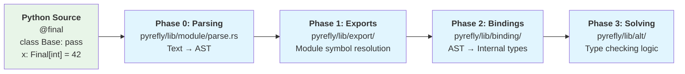
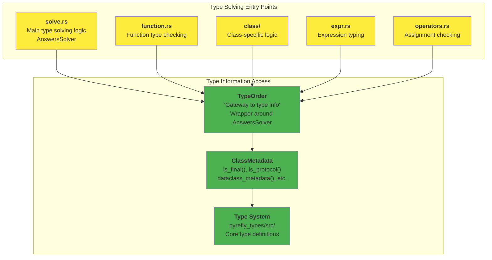
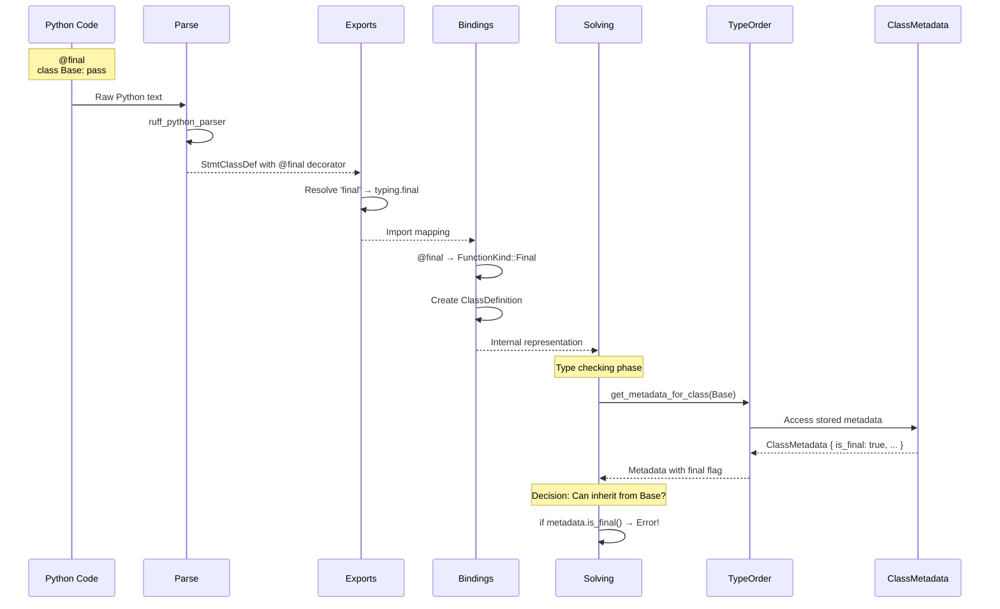
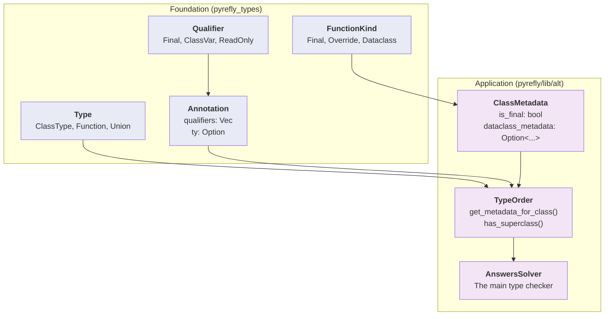

# Pyrefly Developer Architecture Guide

## Quick Start: Adding Type Checking Rules

**Problem**: You want to add a new type checking rule. Where do you put the code?

**Answer**: `pyrefly/lib/alt/solve.rs` - This is where 90% of type checking logic lives.

### Example: Self Return Type Check

```python
from typing import Self

class A:
    def test(self) -> Self:
        return A()  # Error: should return Self, not A
```

**Your code goes in**: `pyrefly/lib/alt/solve.rs` or `pyrefly/lib/alt/function.rs`

## The Complete Processing Pipeline

Pyrefly processes Python code through **4 distinct phases**:



### Phase 0: Parsing

**Location**: `pyrefly/lib/module/parse.rs`

**What it does**: Converts Python text to AST using `ruff_python_parser`

```python
@final
class Base: pass
```
↓
```rust
StmtClassDef {
    name: "Base",
    decorator_list: [
        Decorator {
            id: "final"
        }
    ],
    // ...
}
```

**Key files**:
- `pyrefly/lib/module/parse.rs` - Main parsing logic
- `crates/pyrefly_python/src/ast.rs` - AST utilities

### Phase 1: Export Resolution

**Location**: `pyrefly/lib/export/`

**What it does**: Figures out what names each module exports and resolves `import *` statements

**Example**:
```python
# module_a.py
from typing import final, Final  # ← Must resolve where 'final' comes from
from other_module import *       # ← Must figure out what this imports

@final
class MyClass: pass
```

**The Problem**: When you see `@final`, the type checker needs to know:
1. Where does `final` come from? (Answer: `typing.final`)
2. What does it mean? (Answer: `FunctionKind::Final`)

**Key files**:
- `pyrefly/lib/export/exports.rs` - Export analysis
- `pyrefly/lib/export/definitions.rs` - Definition tracking
- `pyrefly/lib/module/finder.rs` - Module resolution

### Phase 2: Binding Creation

**Location**: `pyrefly/lib/binding/`

**What it does**: Converts AST to Pyrefly's internal representation

```python
@final
class Base: pass

x: Final[int] = 42
```
↓
```rust
// Class with final decorator
ClassDefinition {
    decorators: [FunctionKind::Final],
    // ...
}

// Variable with Final annotation
AnnotatedType(
    KeyAnnotation {
        annotation: Annotation {
            qualifiers: [Qualifier::Final],
            ty: Some(Type::Int)
        }
    },
    binding
)
```

**Key files**:
- `pyrefly/lib/binding/stmt.rs` - Statement processing
- `pyrefly/lib/binding/class.rs` - Class definitions
- `pyrefly/lib/binding/binding.rs` - Core binding types

### Phase 3: Type Solving (Where You Add Code)

**Location**: `pyrefly/lib/alt/`

**What it does**: Performs actual type checking and validation

This is where **your new type checking rules go**.

## Understanding Type Solving Architecture

### The Key Players



### TypeOrder: Your Gateway to Type Information

**The Confusing Name**: `TypeOrder` sounds like it orders types, but it's actually your **database connection** for type information.

```rust
pub struct TypeOrder<'a, Ans>(&'a AnswersSolver<'a, Ans>);
```

**What it provides**:
- Class metadata (Final decorators, protocols, dataclasses)
- Inheritance relationships
- Standard library types
- Type conversions

**Think of it as**: The "context object" that gives you access to everything you need during type checking.

### How to Access Final Annotations

```rust
// ❌ WRONG (what the buggy code does)
self.is_type_order.is_class_def_final(got)

// ✅ CORRECT (what you should do)
self.type_order.get_metadata_for_class(got).is_final()
```

### Complete Data Flow for Final



## Implementing the Fix

### The Bug

**File**: `pyrefly/lib/solver/subset.rs:973`

```rust
// Current buggy code
(Type::ClassDef(got), Type::ClassDef(want)) => ok_or(
    self.type_order.has_superclass(got, want)
        && self.is_type_order.is_class_def_final(got), // ← BUG: Wrong field name
    SubsetError::Other,
),
```

**Problems**:
1. `self.is_type_order` doesn't exist (should be `self.type_order`)
2. `is_class_def_final()` method doesn't exist
3. Logic is backwards (should prevent inheritance FROM final classes)

### The Fix

```rust
// Fixed version
(Type::ClassDef(got), Type::ClassDef(want)) => {
    // Check if we're trying to inherit from a final class
    let want_metadata = self.type_order.get_metadata_for_class(want);
    if want_metadata.is_final() {
        // Cannot inherit from final class
        Err(SubsetError::Other)
    } else {
        // Normal inheritance check
        ok_or(
            self.type_order.has_superclass(got, want),
            SubsetError::Other,
        )
    }
}
```

### Step-by-Step Implementation

1. **Find the bug**:
   ```bash
   # Open the file
   vim pyrefly/lib/solver/subset.rs
   # Go to line 973
   :973
   ```

2. **Understand the context**:
   - This code handles `Type::ClassDef` subset checking
   - It's checking if `got` is a subtype of `want`
   - In inheritance: `class Child(Parent)` → `Child` ⊆ `Parent`

3. **Fix the logic**:
   ```rust
   (Type::ClassDef(got), Type::ClassDef(want)) => {
       let want_metadata = self.type_order.get_metadata_for_class(want);
       if want_metadata.is_final() {
           Err(SubsetError::Other)
       } else {
           ok_or(
               self.type_order.has_superclass(got, want),
               SubsetError::Other,
           )
       }
   }
   ```

4. **Test your fix**:
   ```rust
   // Add to pyrefly/lib/test/simple.rs
   testcase!(
       test_final_inheritance,
       r#"
   from typing import final

   @final
   class Base: pass

   class Child(Base):  # E: Cannot inherit from final class
       pass
   "#
   );
   ```

   ```bash
   cargo test test_final_inheritance
   ```

## Where to Add Different Types of Checks

### Function Return Types
**File**: `pyrefly/lib/alt/function.rs`
**Example**: Self return type validation

### Class Inheritance
**File**: `pyrefly/lib/alt/class/class_metadata.rs`
**Example**: Final class inheritance (your case)

### Variable Assignments
**File**: `pyrefly/lib/alt/operators.rs`
**Example**: Assignment to Final variables

### Expression Type Checking
**File**: `pyrefly/lib/alt/expr.rs`
**Example**: Method call validation

### Type Subset Relations
**File**: `pyrefly/lib/solver/subset.rs`
**Example**: Subtyping rules (your case)

## Debugging Tips

### Print Debugging
```rust
// Quick debugging
dbg!(&got, &want);
dbg!(self.type_order.get_metadata_for_class(want).is_final());
```

### Running Single Tests
```bash
# Run specific test
cargo test test_final_inheritance -- --nocapture

# Run all final-related tests
cargo test final -- --nocapture
```

### Finding Related Code
```bash
# Find all final-related code
grep -r "final\|Final" pyrefly/lib/alt/

# Find similar inheritance checks
grep -r "has_superclass" pyrefly/lib/
```

## The Type System Hierarchy



## Summary

1. **Your fix goes in**: `pyrefly/lib/solver/subset.rs:973`
2. **Access final info via**: `self.type_order.get_metadata_for_class(class).is_final()`
3. **Test with**: Add test case in `pyrefly/lib/test/simple.rs`
4. **TypeOrder is**: Your "database connection" for type information
5. **The phases preserve**: All annotations through the pipeline

The key insight is that `TypeOrder` is your friend - it gives you access to all the metadata that's not directly in the `Type` enum itself.