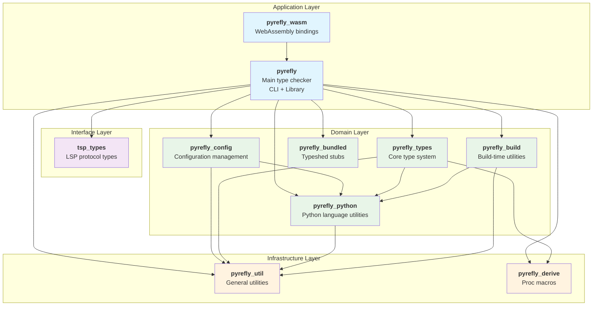

# Pyrefly Crate Structure

## Overview

Pyrefly is organized as a Cargo workspace with clear dependency layers. Each crate has a specific purpose and well-defined boundaries.



## Crate Purposes

### Infrastructure Layer (Foundation)

#### `pyrefly_derive` - Procedural Macros
**Purpose**: Code generation for common patterns

**Provides**:
- `#[derive(TypeEq)]` - Type equality checking
- `#[derive(Visit)]` - Immutable tree traversal
- `#[derive(VisitMut)]` - Mutable tree transformation

**Example Usage**:
```rust
#[derive(Debug, Clone, TypeEq, VisitMut)]
pub enum Qualifier {
    Final,
    ClassVar,
    ReadOnly,
}
```

**Dependencies**: None (proc macro crate)

#### `pyrefly_util` - General Utilities
**Purpose**: Infrastructure utilities with no Python-specific knowledge

**Provides**:
- Memory tracking and reporting
- Display formatting utilities
- Visitor pattern infrastructure
- Locking primitives and thread utilities
- File system abstractions

**Example**:
```rust
use pyrefly_util::display::commas_iter;
use pyrefly_util::visit::{Visit, VisitMut};
use pyrefly_util::memory::Bytes;

// Pretty printing
format!("Types: {}", commas_iter(|| types.iter())) // "int, str, bool"

// Memory tracking
let usage = Bytes::from(1024); // "1.0 KB"
```

**Dependencies**: None

### Domain Layer (Python-specific)

#### `pyrefly_python` - Python Language Utilities
**Purpose**: Python language knowledge without type checking

**Provides**:
- Module name handling (`ModuleName::typing()`)
- Python keywords by version
- Dunder method constants
- AST utilities for ruff integration

**Example**:
```rust
use pyrefly_python::module_name::ModuleName;
use pyrefly_python::dunder;
use pyrefly_python::keywords::get_keywords;

// Module handling
let typing_module = ModuleName::typing();

// Magic methods
const INIT = dunder::INIT; // "__init__"

// Version-specific keywords
let py310_keywords = get_keywords(PythonVersion::new(3, 10, 0));
```

**Dependencies**: `pyrefly_util`

#### `pyrefly_types` - Core Type System
**Purpose**: Defines the Pyrefly type system

**Provides**:
- `Type` enum (the central type representation)
- `Annotation` with qualifiers like `Qualifier::Final`
- `FunctionKind::Final` for decorators
- Special forms (`Self`, `Final`, `Union`, etc.)
- Read-only enforcement (`ReadOnlyReason::Final`)

**Example**:
```rust
use pyrefly_types::annotation::{Annotation, Qualifier};
use pyrefly_types::callable::FunctionKind;
use pyrefly_types::types::Type;

// Final variable annotation
let annotation = Annotation {
    qualifiers: vec![Qualifier::Final],
    ty: Some(Type::Int),
};

// Check if annotation is final
if annotation.is_final() {
    // Handle final variable
}

// Final decorator
let final_decorator = FunctionKind::Final;
```

**Dependencies**: `pyrefly_derive`, `pyrefly_python`, `pyrefly_util`

#### `pyrefly_bundled` - Standard Library Stubs
**Purpose**: Embeds Python standard library type stubs

**Provides**:
- Compressed typeshed stubs
- Runtime access to `.pyi` files
- Build-time stub processing

**Usage**: Automatically used by the type checker to resolve standard library types

**Dependencies**: Build-time only

#### `pyrefly_config` - Configuration Management
**Purpose**: Configuration file parsing and management

**Provides**:
- Pyproject.toml parsing
- Mypy configuration compatibility
- Error kind definitions
- Settings validation

**Dependencies**: `pyrefly_python`, `pyrefly_util`

#### `pyrefly_build` - Build Utilities
**Purpose**: Build-time code generation and utilities

**Dependencies**: `pyrefly_python`, `pyrefly_util`

### Interface Layer

#### `tsp_types` - LSP Protocol Types
**Purpose**: Language Server Protocol type definitions

**Provides**:
- LSP message types
- TypeScript Protocol bindings
- IDE integration types

**Dependencies**: None (standalone)

### Application Layer

#### `pyrefly` - Main Type Checker
**Purpose**: The complete type checker implementation

**Contains**:
- **4-phase processing pipeline**:
  - `lib/module/parse.rs` - Parsing (Phase 0)
  - `lib/export/` - Export resolution (Phase 1)
  - `lib/binding/` - Bindings creation (Phase 2)
  - `lib/alt/` - Type solving (Phase 3)
- **CLI interface** (`lib/commands/`)
- **LSP server** (`lib/state/`, `lib/lsp/`)
- **Error reporting** (`lib/error/`)
- **Testing framework** (`lib/test/`)

**Dependencies**: ALL other pyrefly crates

#### `pyrefly_wasm` - WebAssembly Interface
**Purpose**: Compiles Pyrefly to WebAssembly for browser usage

**Provides**:
- WASM bindings for the web sandbox
- JavaScript-compatible API
- Browser-safe type checking

**Dependencies**: `pyrefly` (main crate)

## Dependency Rules

### Allowed Dependencies

```rust
// ✅ Higher layers can depend on lower layers
pyrefly → pyrefly_types → pyrefly_python → pyrefly_util

// ✅ Same layer dependencies (with care)
pyrefly_config → pyrefly_python

// ✅ Infrastructure used everywhere
* → pyrefly_util
* → pyrefly_derive
```

### Forbidden Dependencies

```rust
// ❌ Lower layers cannot depend on higher layers
pyrefly_util → pyrefly_python  // FORBIDDEN

// ❌ Domain layers should not cross-depend without reason
pyrefly_config → pyrefly_types  // Usually avoided

// ❌ Infrastructure should not know about domain
pyrefly_util → pyrefly_python  // FORBIDDEN
```

## How to Choose the Right Crate

### Adding Type System Features
**Target**: `pyrefly_types`
**Examples**: New type kinds, annotations, special forms

### Adding Python Language Support
**Target**: `pyrefly_python`
**Examples**: New keywords, dunder methods, AST utilities

### Adding Type Checking Logic
**Target**: `pyrefly/lib/alt/`
**Examples**: New validation rules, inheritance checks

### Adding Infrastructure
**Target**: `pyrefly_util`
**Examples**: Data structures, algorithms, utilities

### Adding Configuration
**Target**: `pyrefly_config`
**Examples**: New settings, config file formats

## Import Patterns

### In Foundation Crates
```rust
// pyrefly_types/src/annotation.rs
use pyrefly_derive::{TypeEq, VisitMut};  // Macros
use pyrefly_util::display::commas_iter;  // Utilities
use pyrefly_python::module_name::ModuleName;  // Python knowledge
```

### In Application Crate
```rust
// pyrefly/lib/alt/solve.rs
use pyrefly_types::annotation::{Annotation, Qualifier};
use pyrefly_python::dunder;
use pyrefly_util::visit::VisitMut;
```

## Architecture Benefits

### Clear Separation of Concerns
- **Infrastructure** is reusable and Python-agnostic
- **Domain** layer encapsulates Python knowledge
- **Application** layer implements business logic

### Testability
- Each crate can be tested independently
- Foundation crates have no external dependencies
- Mock implementations are easier

### Build Performance
- Only changed crates rebuild
- Parallel compilation of independent crates
- Smaller compilation units

### Reusability
- `pyrefly_types` could be used by other Python tools
- `pyrefly_util` is completely generic
- `pyrefly_python` provides reusable Python utilities

This architecture enables clean development where you know exactly where to add new functionality based on its purpose and dependencies.